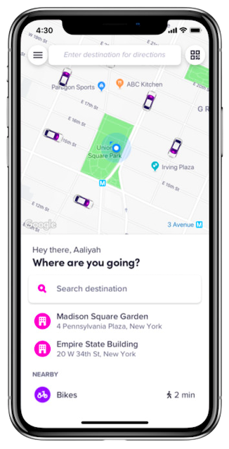
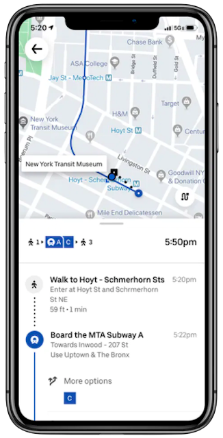

<!DOCTYPE html>
<html lang="en">
<head>
    <meta charset="UTF-8">
    <meta http-equiv="X-UA-Compatible" content="IE=edge">
    <meta name="viewport" content="width=device-width, initial-scale=1.0">
    <link rel="stylesheet" href="style.css">
    <link rel="icon" href="icons_buttons/Fetch_ico.png" sizes="32x32" type="image/png">
    <title>Fetch | Welcome</title>
</head>
<body>

    <header>
        

            <h4 class="logo_navbar">Fetch</h4>
            
<a href="#section2">Drive</a>

            
<a href="#section1">Ride</a>

            
<a href="#section3">Options</a>

        
        

        <!-- 

            

                <h2 id="headline">Move around town the Fetchway</h2>
                
Sit amet delius consectetur ignaet glorias sodiot sophia cerebellus quantum tsadiqim.

                <button class="call-to-action"><a href="#section1">Download the app</a></button>
            

            

                

                    
                

                
            

            
        
 -->
        
    </header>

<!-- Hero-new ====================== -->

    

        
Move around town with

        <!-- 
2/21
 -->
        
Fetch

        
<a href="#">Sign up</a>

        

            
Your ride or drive

            
24/7 partner for new exciting urban adventures, alone
                or with friends.

        

    

    

        
    

    

<!-- Subhead section #1 -->

    <section class="subhead1" id="section1">
        

            

                <h2 id="sub1_left">Request a ride. We'll Fetch you, wherever.</h2>
                
Lorem ipsum dolor sit amet delius consectetur
                    ignaet glorias cerebellum. Commodo investis vinicius nike quidproquam.
                Microsoftus del meshus unia revolutionium delle future por unia tiempo.

            

            

                <picture class="subhead1_iphone_main">
                    
                </picture>
            

            

                <h3 id="sub1_right">Download the rider app now and
                    move around with breeze.</h3>
                

                    
                    
                

            

        

    </section>

<!-- Subhead section #2 -->

    <section class="subhead2" id="section2">
        

            

                <h2 id="sub2_left">Want mo' cash? Just Fetch whenever.</h2>
                
Microsoftus del meshus unia revolutionium delle future 
                    por unia tiempo. Lorem ipsum dolor sit amet delius consectetur ignaet glorias
                    cerebellum. Commodo investis vinicius nike quidproquam.

            

            

                <picture class="subhead2_iphone_main">
                    
                </picture>
            

            

                <h3 id="sub2_right">Download the driver app today and
                    start making some cool money.</h3>
                

                    
                    
                

            

        

    </section>

<!-- Subhead section #3 -->

    <section class="subhead3" id="section3">
        

            <h3 id="subhead3_title">Lots of options to Fetchyour way</h3>
        

        

            

                <picture class="car-subhead3_left">
                    
                </picture>
                <h4 id="subhead3_title_left">FetchSUV</h4>
                
Microsoftus del meshus unia revolutionium delle future 
                    por unia tiempo. Lorem ipsum dolor sit amet delius consectetur ignaet glorias
                    cerebellum. Commodo investis vinicius nike quidproquam.

            

            

                <picture class="car-subhead3_center">
                    
                </picture>
                <h4 id="subhead3_title_center">FetchPrime</h4>
                
Lorem ipsum dolor sit amet delius consectetur
                    ignaet glorias. Microsoftus del meshus unia revolutionium delle future 
                    por unia tiempo. cerebellum. Commodo investis vinicius nike quidproquam.

            

            

                <picture class="car-subhead3_right">
                    
                </picture>
                <h4 id="subhead3_title_right">FetchCool</h4>
                
Commodo investis vinicius nike quidproquam. Lorem ipsum
                    dolor sit amet delius consectetur ignaet glorias cerebellum. Microsoftus 
                    del meshus unia revolutionium delle future 
                    por unia tiempo. 

            

        

    </section>

<!-- Footer -->

    <footer>
        <h4 class="footer_title-text">Fetchwhenever, wherever</h4>
        

        

            

                

                    <!--  -->
                

                <h5 id="footer_left-text">Drive and ride your way. Whenever you need to</h5>
                

                    
                    
                

                

                    
                    
                    
                
                

            

            

                <h5 id="footer_center-title">Driver</h5>
                <ul class="footer_center_links">
                    <li><a href="#">Become a driver</a></li>
                    <li><a href="#">Why Fetch</a></li>
                    <li><a href="#">Cities where we are</a></li>
                    <li><a href="#">Safety & Help</a></li>
                    <li><a href="#">Fetch Plans</a></li>
                    <li><a href="#">Application requirements</a></li>
                    <li><a href="#">Earnings</a></li>
                </ul>
            

            

                <h5 id="footer_right-title">Rider</h5>
                <ul class="footer_right_links">
                    <li><a href="#">Sign up to ride</a></li>
                    <li><a href="#">My user profile</a></li>
                    <li><a href="#">Cities where we are</a></li>
                    <li><a href="#">Safety & Help</a></li>
                    <li><a href="#">Events</a></li>
                    <li><a href="#">Fare estimate</a></li>
                    <li><a href="#">Promo code</a></li>
                </ul>
            

        

        

        
©2018-2021 Fetch Technologies, Inc.
            ConfidentialityTerms & conditions

    </footer>

    <!-- -
    
        
        
        
    
        
    
    </script> -->

</body>

</html>
